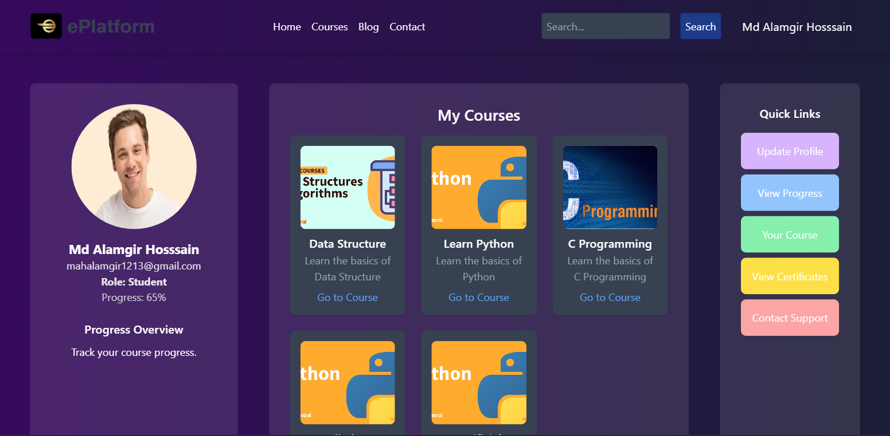
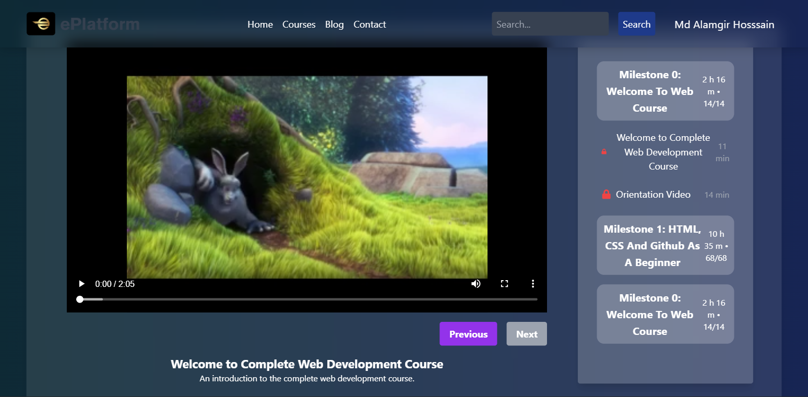
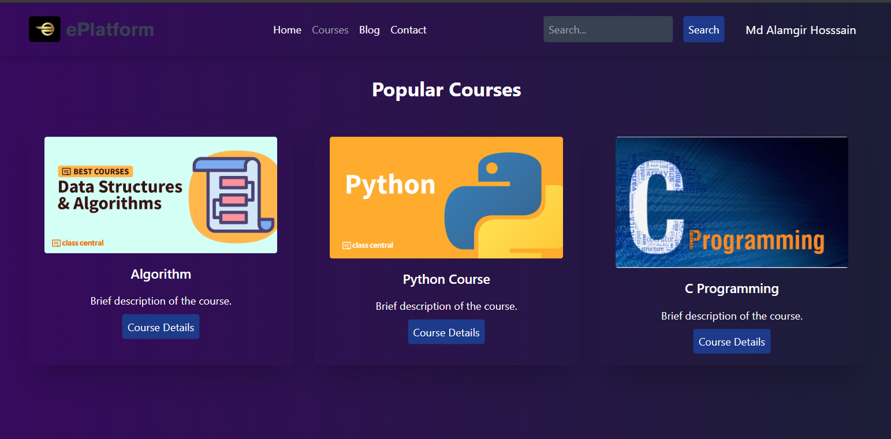
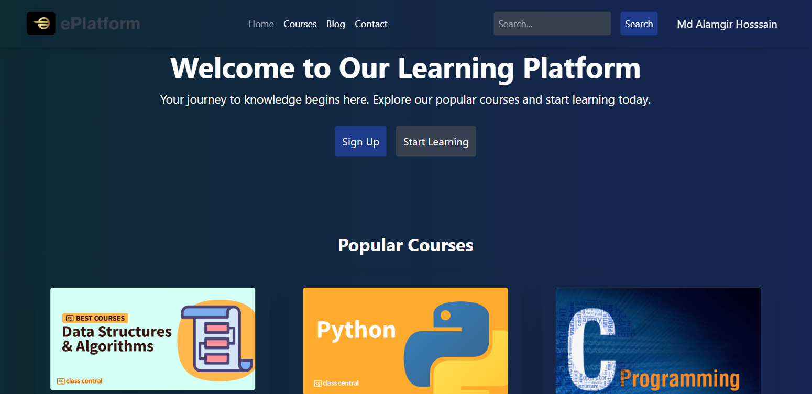
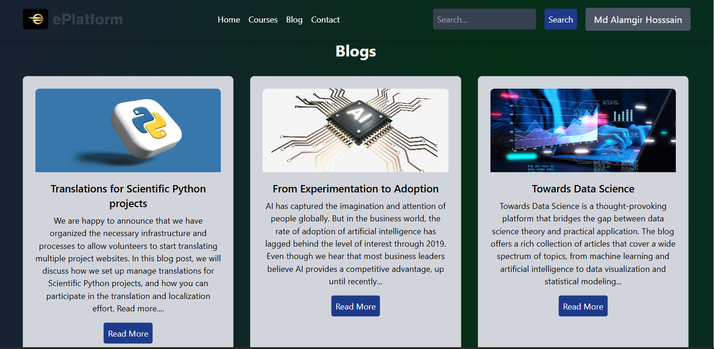
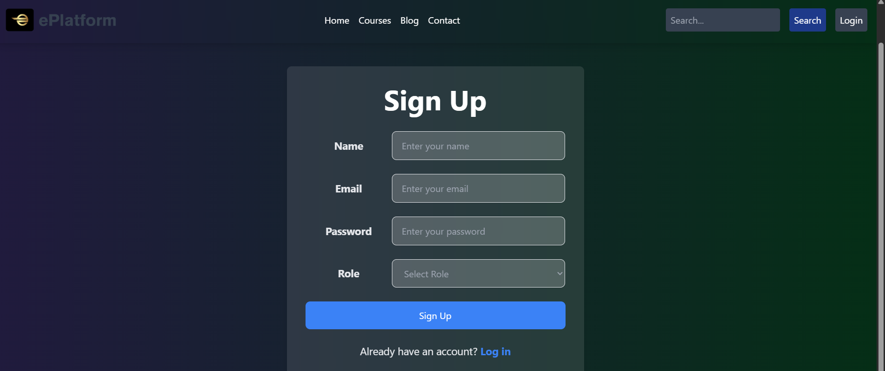
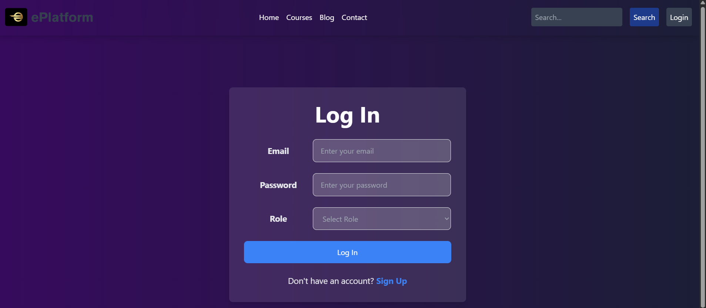

# SMART LEARNING PLATFORM

Smart Learning Platform enhances online education with webcam engagement tracking, randomized quizzes, progress reports, and time-tracking. Instructors benefit from easy course creation, video/blog management, and real-time tracking. Rewards and leaderboards boost student motivation. Built with React, Express.js, and MySQL.

## 🚀 Features

### 1. **User Roles and Capabilities**

#### 👨‍🎓 **Students**
- Access milestone-based video lessons.
- Watch videos with engagement and time tracking.
- Participate in randomized quizzes after each lesson.
- Unlock next content only after quiz completion.
- View progress reports and course status.
- Earn rewards and points for completed tasks.
- Download certificates upon course completion.

#### 👨‍🏫 **Instructors**
- Create and manage courses with milestones and videos.
- Add and edit quizzes and exam questions.
- Manage blogs and post educational content.
- Monitor student performance in real-time.
- Track quiz and video completion data.

#### 🛠️ **Admin (Optional Role)**
- Oversee user management and content moderation.
- Approve or remove courses and blogs.
- Handle system maintenance and data backup.

---

### 2. **System Requirements**

#### ✅ Functional Requirements
- User registration and login with JWT authentication.  
- Role-based dashboard access (Student, Instructor).  
- Course and milestone creation with video uploads.  
- Randomized quiz generation and evaluation.  
- Real-time engagement tracking with camera/time monitoring.  
- Certificate generation and download.  
- Progress tracking and reporting.

#### 🔐 Non-Functional Requirements
- Secure login and data encryption.  
- Fast response time and optimized performance.  
- Mobile-responsive and accessible UI.  
- Scalable and maintainable architecture.  
- Reliable database connection and backup support.

---

## 🛠️ Technology Stack

- **Frontend:** React.js, Tailwind CSS  
- **Backend:** Node.js, Express.js  
- **Database:** MySQL  
- **Authentication:** JSON Web Token (JWT)  
- **Media & Tools:** React Player, Toast Notifications, Chart.js  
- **Development Tools:** Visual Studio Code, Postman, MySQL Workbench, Git

---

## 📄 Project Documentation

- 📘 **SRS (Software Requirements Specification):**  
  [Click to view SRS](https://drive.google.com/file/d/1tbjXEZcKCA82Qney97IVgzMmcG4fC2db/view?usp=sharing)

- 📑 **Project Report:**  
  [Click to view Project Report](https://drive.google.com/file/d/1umLpzCsV8QQnbxYrehQ6dtIzEYe1upCE/view?usp=sharing)

## 📸 Screenshots

  
*Student Dashboard*

  
*Interactive Video Player with Quiz System*

  
*Course List*

  
*Student Progress Overview*

  
*Home Page*

  
*Blog Page*

  
*Sign Up Page*

  
*Login Page*

---

## 🧑‍🏫 Supervisor

**Name:** Dr. Mohammd Nuruzzaman Bhuyian  
**Position:** Assistant Professor, Institute of Information Technology  
**Institution:** Noakhali Science and Technology University

## 📬 Contact

**Author:** Md Alamgir Hossain  
📧 **Email:** [mahalamgir1213@gmail.com](mailto:mahalamgir1213@gmail.com)  
🔗 **GitHub:** [@Alamgir2-2](https://github.com/Alamgir2-2)  
🔗 **LinkedIn:** [linkedin.com/in/alamgir22](https://www.linkedin.com/in/alamgir22/)
